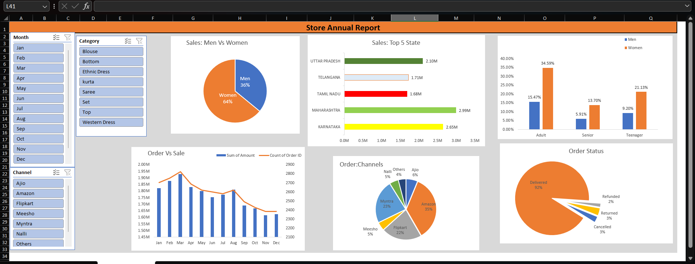

# Store-Data-Analysis
Excel Data Analysis Project using Pivot Tables, Charts, and Dashboard.
# 📊 Store Data Analysis Dashboard

  <b>📈 Excel Data Analysis Project | Interactive Dashboard | Business Insights</b>

---

## 📌 Project Overview

This project analyzes store sales data using Microsoft Excel. The dashboard provides valuable business insights through interactive visualizations, Pivot Tables, Charts, and Slicers to support data-driven decision-making.

---

## 🎯 Project Objectives

- Analyze monthly sales performance
- Identify top-selling products
- Compare sales across different states
- Analyze customer demographics
- Evaluate order status and sales channels
- Build an interactive dashboard for business reporting

---

## 🛠️ Tools & Technologies

- 📗 Microsoft Excel
- 📊 Pivot Tables
- 📈 Pivot Charts
- 🎛️ Slicers
- 🧹 Data Cleaning
- 📋 Excel Formulas
- 📉 Dashboard Design

---

## 📊 Dashboard Features

- ✅ Monthly Sales Analysis
- ✅ State-wise Sales
- ✅ Category-wise Sales
- ✅ Sales Channel Analysis
- ✅ Customer Age & Gender Analysis
- ✅ Order Status Analysis
- ✅ Interactive Dashboard

---

## 📸 Dashboard Preview

---

## 📂 Repository Contents

📁 STORE DATA DASHBOARD.xlsx – Excel Dashboard

🖼️ STORE DATA DASHBOARD.png – Dashboard Screenshot

📄 README.md – Project Documentation

---

## 🚀 Skills Demonstrated

- Data Cleaning
- Data Analysis
- Data Visualization
- Dashboard Development
- Business Intelligence
- Reporting
- Problem Solving

---

## 👨‍💻 Author

**Nitesh Chaudhari**

Aspiring Data Analyst

### Connect with Me

- GitHub: https://github.com/niteshchaudhari1731
- LinkedIn: *(Add your LinkedIn profile link here)*

---

## ⭐ Support

If you like this project, please ⭐ Star this repository.

Thank you for visiting!
